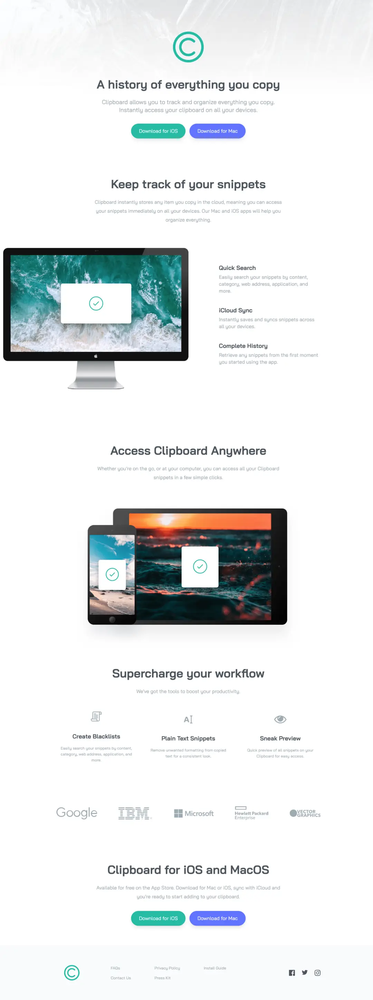
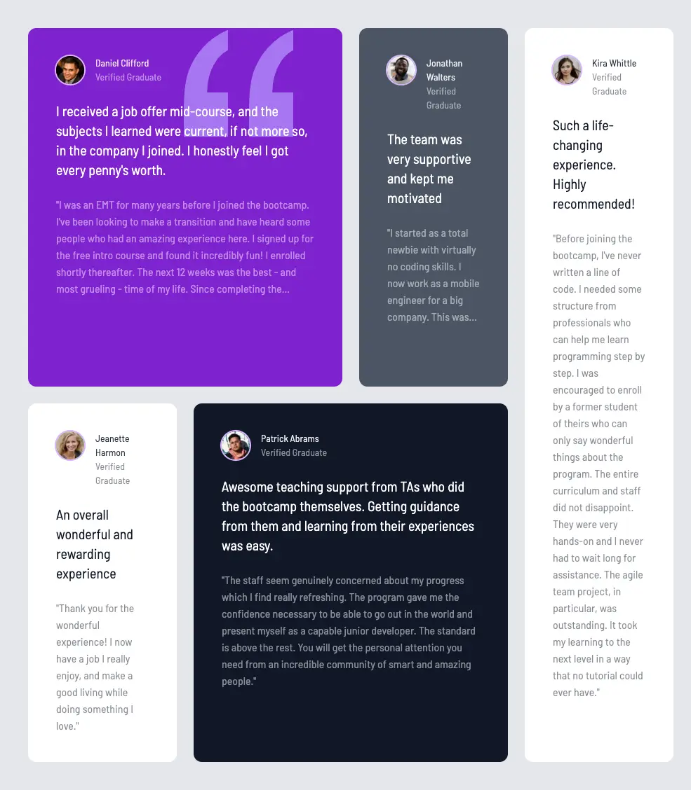

# Static Sites

- All static sites that simply deploy with GitHub.
- Please give this source a star, thank you so much 🥰.

## Preview 🔽	

### VN Travel
- Preview: https://minhtc-tech.github.io/project/vn-travel/

---

### Thien Ha Book
- Preview: https://minhtc-tech.github.io/project/thien-ha-book/ 

---

### Shopee
- Preview: https://minhtc-tech.github.io/project/shopee/

---

### Landing Pages

#### Bookmark
- Preview: https://minhtc-tech.github.io/project/landing/bookmark/

---

#### ClipBoard
- Preview: https://minhtc-tech.github.io/project/landing/clipboard/

---

#### Fylo
- Preview: https://minhtc-tech.github.io/project/landing/fylo/

---

#### Loop Studios
- Preview: https://minhtc-tech.github.io/project/landing/loop-studios/

---

#### Shortly
- Preview: https://minhtc-tech.github.io/project/landing/shortly/

---

#### Testimonial
- Preview: https://minhtc-tech.github.io/project/landing/testimonial-grid/

---
